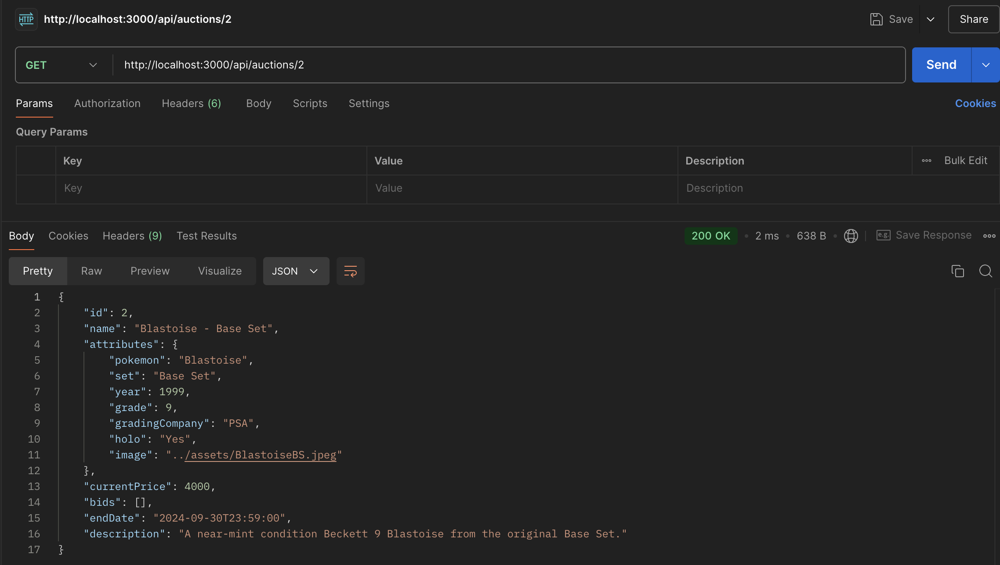

# Testing

> Place your test plan, test report and traceability matrix here

## Traceability matrix

### Functional

The table below shows an overview of which test covers which functional requirements

| Test | F1 | F2 | F3 | F4 | F5 | F6 | F7 | F8 | F9 | F10 | 
|:----:|:--:|:--:|:--:|:--:|:--:|:--:|:--:|:--:|:--:|:---:|
|  T1  | x  | x  | x  | x  |    |    | x  | x  |    |     |
|  T2  |    |    |    |    | x  | x  |    | x  | x  |  x  |

### Non funtional

The table below shows an overview of which test covers which non-functional requirements

| Test | NF1 | NF2 | NF3 | NF4 | NF5 | NF6 | NF7 | NF8 | NF9 | NF10 | NF11 | NF12 | NF13 | NF14 | NF15 | NF16 | NF17 | NF18 | NF19 | 
|:----:|:---:|:---:|:---:|:---:|:---:|:---:|:---:|:---:|:---:|:----:|:----:|:----:|:----:|:----:|:----:|:----:|:----:|:----:|:----:|
|  T1  |  x  |  x  |  x  |  x  |  x  |  x  |  x  |  x  |  x  |  x   |  x   |  x   |  x   |  x   |  x   |  x   |  x   |  x   |  x   |

## Test plan
### Intro
**Beschrijving van het project**: Auction house replicaten d.m.v. een backend gecombineerd met een frontend die Svelte gebruikt.
In de applicatie moet een admin een auction item kunnen toevoegen, verwijderen of aanpassen. Site visitors kunnen de website bekijken.
Als ze op een item willen bieden, moeten ze eerst registeren of inloggen.

**Doelgroep van het rapport**: Richard

### Doel van de tests
Met het testrapport wil ik aantonen dat het gemaakte applicatie voldoet aan de functional en non-functional requirements.
Deze requirements zijn ons gegeven en laten precies zien wat moet werken en getest moet kunnen worden.

### Testomvang
**Wat wordt er getest**: 
- Inloggen en registreren
- Functionaliteit van de auction house admin (plaatsen, editen, verwijderen).
- User- en role-based functionaliteiten (bieden)
- Filteren en sorteren d.m.v. queries
- Status codes
- REST
- Documentatie
- Beveiliging
- Verificatie en authenticatie

## Test report

## Functional Tests

### Test 1 (T1)
Met Test 1 gaan we de core-functionaliteiten van de applicatie testen. Dit zijn de volgende requirements hieronder.

| ID  | Description                                                                                                                                                                                         | MoSCoW | Success |
|:---:|-----------------------------------------------------------------------------------------------------------------------------------------------------------------------------------------------------|:------:|:-------:|
| F1  | Display a list of auctionable products or services                                                                                                                                                  |   M    |    ✅    |
| F2  | For each products or services show at least the following:   - Product or service name   - The price (these should be integer values)   - Who placed bids   - When will the auction end |   M    |    ✅    |
| F3  | It must be possible to search the list of auctions on a title or name                                                                                                                               |   M    |    ✅    |
| F4  | Bids cannot be removed or modified once they are made                                                                                                                                               |   M    |    ✅    |
| F7  | The list of auctions can be filtered on at least 3 attributes that are logical for the chosen service or product. I.e.:   - Pokemon sets  - Ongoing auctions  - All cards under 2000       |   M    |    ✅    |
| F8  | A list of bids updates in realtime if another user places a bid on the product or service                                                                                                           |   S    |    ✅    |

Zodra de applicatie wordt gestart kom je op de homepagina. 

Hier zien we F1 een lijst met producten en services en F2 elk product heeft een naam, een prijs, datum wanneer de auction eindigt. De auction timer is universeel en tikt elke seconde door.
Wie een bod heeft geplaatst zien we iets later.

Ik heb 6 filters voor F3 en F7 die je kan gebruiken. Alle 6 zijn functioneel, hieronder de resultaten.

Filter op naam: Dit kan dus ook met een paar karakters

Filter op set:

Filter op grading company:

Filter op grade:

Filter op status: (ended auction of ongoing)

Filter op prijs:

We gaan nu inloggen om te kunnen bieden. Hiervoor klik je rechtsboven op de P van 'Profiel'
En in de dropdown menu kun je inloggen of registreren. Beide zijn functioneel, maar voor nu loggen we in met de gegevens van de user die zijn meegegeven in users.md

Op de homepagina klikken we op de knop "View Details" op de 4e auction "Pickachu - Jungle Set (Grade: 10)" Dan komen we op de volgende pagina:

Hier kunnen we F2, wie bids heeft geplaatst ook zien. 

We gaan nu een bid plaatsen. We voeren een getal hoger dan de huidige prijs in en dan wordt onze bid real-time geupdate op deze pagina:

We zien hier F4 en F8. De bids worden real time geupdate en geplaatste bids kunnen niet gewijzigd of verwijderd worden. Hiervoor is er ook geen endpoint.

Nu we op deze prachtige pikachu hebben geboden kunnen we op de homepagina zien dat de prijs van de kaart nu ook is geupdate. De prijs is van 1200 naar 1300:

### Test 2 (T2)
Met Test 2 gaan we de admin-functionaliteiten testen, functionaliteit van de 2 rollen en de validatie van bij invoervelden.

| ID  | Description                                                    | MoSCoW | Success |
|:---:|----------------------------------------------------------------|:------:|:-------:|
| F5  | Input is validated client side before sending it to the server |   M    |    ✅    |
| F6  | Input is validated server side                                 |   M    |    ✅    |
| F9  | Only users with a `bidder` role can place bids                 |   M    |    ✅    |
| F10 | Only users with an `admin` role can manage auctions            |   M    |    ✅    |

We loggen als eerst in als admin met de gegeven gegevens in users.md. Als het is gelukt zie je rechtsboven een A en als je hierop klikt zie je Add auction.

Ga naar Add Auction en kom je op de volgende pagina F10: hier kan je een auction toevoegen:

F5 kan hier getest worden door een leeg formulier terug te sturen, grade onder 7 te selecteren (cheap cards...), jaartal onder 1995 in te vullen of startprijs onder 0 in te vullen. Dan krijg je de volgende foutcodes:

F6 Server side:

F9: Admins kunnen geen bids plaatsen:

F10: Admin kan een auction toevoegen en deleten in de details pagina. Zoals in Test 1 te zien was kunnen normale users dit niet. Zij hebben de optie niet voor het editen en deleten.

Edit pagina:

Aangepaste auction (naam is nu Raichu):

Deleten:

Op de homepagina geen Charizard meer:

## Non-Functional Tests

### Test 1 (T1)
In Test 1 ga ik alle Non-Functional Requirements behandelen. Hieronder de requirements:

|  ID  | Description                                                                                                                                         | MoSCoW | Succes |
|:----:|-----------------------------------------------------------------------------------------------------------------------------------------------------|:------:|:------:|
| NF1  | The API returns valid JSON objects or arrays                                                                                                        |   M    |   ✅    |
| NF2  | The API returns appropriate/correct [HTTP status codes](https://en.wikipedia.org/wiki/List_of_HTTP_status_codes)                                    |   M    |   ✅    |
| NF3  | The API uses the correct HTTP verbs for its operations                                                                                              |   M    |   ✅    |
| NF4  | The API implements at least ReST level 3                                                                                                            |   M    |   🚫   |
| NF5  | The API uses query parameters for filtering the result set                                                                                          |   M    |   ✅    |
| NF6  | The API uses query parameters for sorting the result set                                                                                            |   S    |   ✅    |
| NF7  | The API uses query parameters for limiting the result set                                                                                           |   S    |   ✅    |
| NF8  | Both the front-end and backend provide descriptive error messages: 'You already placed a bid', 'Bid already exists', 'User X not allowed to do ...' |   M    |   ✅    |
| NF 9 | Both front-end and backend apply the separation of concerns principle                                                                               |   M    |   ✅    |
| NF10 | API endpoints have meaningfull good and bad weather tests                                                                                           |   M    |   ✅    |
| NF11 | The traceability matrix, test plan and test report are documented in [testing.md](../documentation/testing.md)                                      |   M    |   ✅    |
| NF12 | After registration the user should be logged in. They should not have to log in again before being able to place a bid                              |   M    |   ✅    |
| NF13 | The front-end is build using Svelte (not Svelte Kit)                                                                                                |   M    |   ✅    |
| NF14 | The backend is built using Node js with Express                                                                                                     |   M    |   ✅    |
| NF15 | The front-end is composed of (re-usable) components using a logical structure                                                                       |   M    |   ✅    |
| NF16 | The API uses JSON Web tokens for authorization                                                                                                      |   M    |   ✅    |
| NF17 | The API uses Bcrypt for password hashing                                                                                                            |   M    |   ✅    |
| NF18 | The system uses role-based authentication and authorization                                                                                         |   M    |   ✅    | 
| NF19 | Users can have multiple roles                                                                                                                       |   M    |   ✅    |

#### NF1: The API returns valid JSON objects or arrays 
From Postman:

#### NF2: The API returns appropriate/correct [HTTP status codes](https://en.wikipedia.org/wiki/List_of_HTTP_status_codes) 
Is getest in HTTP test, maar ook in screenshot hierboven '200 OK' of hieronder '404 NOT FOUND'

#### NF3: The API uses the correct HTTP verbs for its operations
In mijn routes kun je zien dat ik :
- GET's gebruik om data te fetchen
- PUT's gebruik om data aan te passen
- POST's gebruik om data nieuwe data toe te voegen of een form te submitten
- DELETE's gebruik om data te verwijderen

#### NF4: The API implements at least ReST level 3
Dit is de enige requirement die mij niet is gelukt om te implementeren.

#### NF5: The API uses query parameters for filtering the result set
User kan filteren op naam, set, grading company, grade, maxPrice en of de auction nog actueel is.

#### NF6: The API uses query parameters for sorting the result set
User kan sorteren op prijs, eind datum en alfabet.

#### NF7: The API uses query parameters for limiting the result set
User kan zoekresultaten limiteren tot een bepaald getal.

#### NF8: Both the front-end and backend provide descriptive error messages: 'You already placed a bid', 'Bid already exists', 'User X not allowed to do ...'
Bij mijn functionele tests kan je zien dat ik dit voor de frontend heb gedaan. Voor mijn backend heb ik dit ook en ze zijn te zien in [backend-tests.http](..%2Ftests%2Frest%2Fbackend-tests.http)

#### NF9: Both front-end and backend apply the separation of concerns principle
Mijn code maakt gebruik van de principe seperation of concerns.

#### NF10: API endpoints have meaningfull good and bad weather tests
Deze staan in: [backend-tests.http](..%2Ftests%2Frest%2Fbackend-tests.http)

#### NF11: The traceability matrix, test plan and test report are documented in [testing.md](../documentation/testing.md)
Dat lees je nu!

#### NF12: After registration the user should be logged in. They should not have to log in again before being able to place a bid
Wanneer je registrert, blijf je ingelogd en kom je automatisch op de homepagina:

#### NF13: The front-end is build using Svelte (not Svelte Kit)
Yes it is.

#### NF14: The backend is built using Node js with Express
Yes it is.

#### NF15: The front-end is composed of (re-usable) components using a logical structure
Hieronder mijn components, hiervan hergebruik ik:

- De AuctionForm voor het editen en deleten van auctions.
- De Card voor de homepagina en won-auctions
- Countdown voor de homepagina, details pagina en op de Card

Hier kun je de won-auctions nog zien

#### NF16: The API uses JSON Web tokens for authorization
Ik gebruik JWT voor het authorisatie van mijn gebruikers in authMiddleware

#### NF17: The API uses Bcrypt for password hashing
BCrypt wordt gebruikt tijdens het registreren van een user in mijn userController

#### NF18: The system uses role-based authentication and authorization
Dit wordt laten zien in de HTTP Test en in mijn routes heb ik de verschillende routes aangeduid welke publiekelijk zijn of juist alleen voor bepaalde rollen zijn.

#### NF19: Users can have multiple roles
Mijn users hebben een roles array. Hierin kunnen meerdere rollen worden opgeslagen. Als voorbeeld heb ik een user aangemaakt met 2 rollen.

